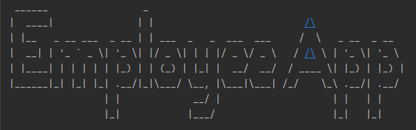

# SETU Employee App [](https://choosealicense.com/licenses/mit/)



Project for SETU Software Development Tools module. Made using Kotlin.

> _"It is a revolutionary app for managing employees, I have never seen anything like it. I would say it stands among the giants in the industry such as Microsoft Excel and SAP."_ - Piotr Placzek (Creator and CEO)

## Features

- [x] CRUD
  - [x] (C) Add employees
  - [x] (R) View employees
    - [x] List employees
  - [x] (U) Edit employees
  - [x] (D) Remove employees
- [x] Advanced features
  - [x] Search employees
  - [x] Sort employees
  - [ ] Filter employees
  - [x] Save employees to file
  - [x] Load employees from file

## Run Locally

Clone the project

```bash
  git clone https://github.com/piotrpdev/employee-app
```

Then you can do one of the following:

- Run the `main.kt` file in your IDE
- Run the `MainKt` or `MainKt (Debug)` run script in IntelliJ IDEA

> Run with `-Dorg.slf4j.simpleLogger.defaultLogLevel=DEBUG` or `MainKt (Debug` to see debug logs

## Authors

- [@piotrpdev](https://www.github.com/piotrpdev)

Code and some instructions taken from:
- [@sdrohan](https://github.com/sdrohan)
- [StackOverflow (See comments)](https://stackoverflow.com/)


## License

[MIT](https://choosealicense.com/licenses/mit/)


